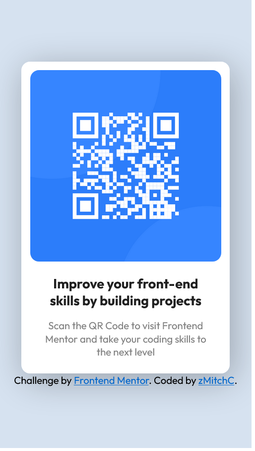

# Frontend Mentor - QR code component solution

This is a solution to the [QR code component challenge on Frontend Mentor](https://www.frontendmentor.io/challenges/qr-code-component-iux_sIO_H). Frontend Mentor challenges help you improve your coding skills by building realistic projects. 

## Table of contents

- [Overview](#overview)
  - [Screenshot](#screenshot)
  - [Links](#links)
- [My process](#my-process)
  - [Built with](#built-with)
  - [What I learned](#what-i-learned)
  - [Continued development](#continued-development)
  - [Useful resources](#useful-resources)
- [Author](#author)
- [Acknowledgments](#acknowledgments)

## Overview

### Screenshot

Desktop design screenshot 

Mobile design screenshot 

### Links

- Live Site URL: [GitHub Page](https://zmitchc.github.io/qr-code-component-main/)

## My process

First of all, in the [HTML file](./index.html) I set up a div with class named "container" to contain the qr code image and the two texts, which I separate using two paragraph since they have different style.

For the CSS, I alternate between inline code and the external [CSS page](./style.css).
For the body, after the color, I put `width: 100%`, so the page can fit no matter how large the screen size of the user is.
I set up the dimension of the container by myself trying to stay as similar as possible to the original design, and for the qrcode image as well. To leave some space between the qrcode and the container I put `padding: 10px`. Afer that, to get rounded corners I used `border-radius: 10px`.
After I finished, I set up the two paragraph style with font family, size, color and padding, centering them in the container.

That's all! :)

### Corrections

After submitting my solution, thanks to tips users gave me, I made the card more responsive through devices using, first of all, `max/min-width` and `max/min-height` with `vh/vw` sizes.

Secondly, I used the `@media` for the `.attribution` text and the `.qrcode-container`. Using that, the container fit correctly on mobile devices as well. 

I put a new method to center the card, which I consider more simple and more dynamical.

I tryed to scale better the card making it a little bit bigger than the first submit.

I modified some attribute everywere, such adding a shadow in the container and other little things just for beauty **like removing an unnoticed second "building" in the title... :|** .

### Built with

- HTML5
- CSS

### What I learned

With this excersise, I learned how to perfectly center a div horizontally and vertically. I know there are others methods, maybe more accurate and I want to learn them!

About the position in CSS, I understood more how `relative` and `absolute` work!

After corrections, I understand how and when use `vh/vw` sizes with `max/min-height/width`. Discovering @media role and understanding that, I learned how to make the site accessible through computers and mobile devices.

### Continued development

I will definitely continue to work on the position of elements in the page.

### Useful resources

- [Center a DIV](https://stackoverflow.com/questions/356809/best-way-to-center-a-div-on-a-page-vertically-and-horizontally) - This helped me to understand how center a div horizontally and vertically
- [Semantic elements](https://www.w3schools.com/html/html5_semantic_elements.asp) - Thanks to [@dimar-hanung](https://www.frontendmentor.io/profile/dimar-hanung) that provided me this helpful source to understand semantic elements!
- [@media role](https://www.w3schools.com/cssref/css3_pr_mediaquery.php) - I found this really useful for the accessibility aspect

## Author

- GitHub - [zMitchC](https://github.com/zMitchC)
- Frontend Mentor - [@zMitchC](https://www.frontendmentor.io/profile/zMitchC)

## Acknowledgment

I want to thanks [@dimar-hanung](https://www.frontendmentor.io/profile/dimar-hanung), [@0xAbdulKhalid](https://www.frontendmentor.io/profile/0xAbdulKhalid) and [@ecemgo](https://www.frontendmentor.io/profile/ecemgo) that helped me correcting my work with really helpful tips. Thank you SO SO much!
